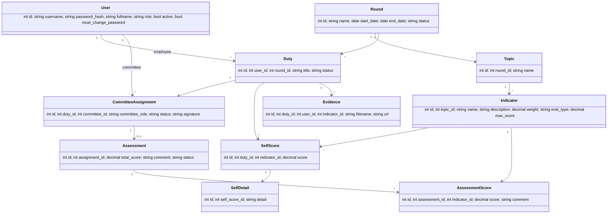

# Class Diagram

```mermaid
classDiagram
 class User {int id; string username; string password_hash; string fullname; string role; bool active; bool must_change_password}
 class Round {int id; string name; date start_date; date end_date; string status}
 class Topic {int id; int round_id; string name}
 class Indicator {int id; int topic_id; string name; string description; decimal weight; string eval_type; decimal max_score}
 class Duty {int id; int user_id; int round_id; string title; string status}
 class CommitteeAssignment {int id; int duty_id; int committee_id; string committee_role; string status; string signature}
 class SelfScore {int id; int duty_id; int indicator_id; decimal score}
 class SelfDetail {int id; int self_score_id; string detail}
 class Evidence {int id; int duty_id; int user_id; int indicator_id; string filename; string url}
 class Assessment {int id; int assignment_id; decimal total_score; string comment; string status}
 class AssessmentScore {int id; int assessment_id; int indicator_id; decimal score; string comment}
 User "1" --> "*" Duty : employee
 Round "1" --> "*" Topic
 Round "1" --> "*" Duty
 Topic "1" --> "*" Indicator
 Duty "1" --> "*" CommitteeAssignment
 User "1" --> "*" CommitteeAssignment : committee
 Duty "1" --> "*" SelfScore
 Indicator "1" --> "*" SelfScore
 SelfScore "1" --> "*" SelfDetail
 Duty "1" --> "*" Evidence
 CommitteeAssignment "1" --> "0..1" Assessment
 Assessment "1" --> "*" AssessmentScore
 Indicator "1" --> "*" AssessmentScore
```
