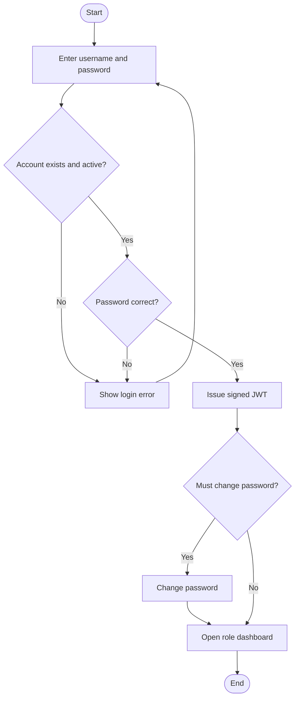
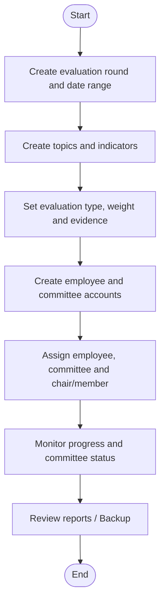
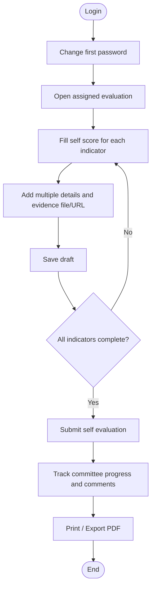
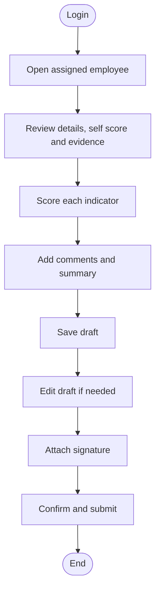
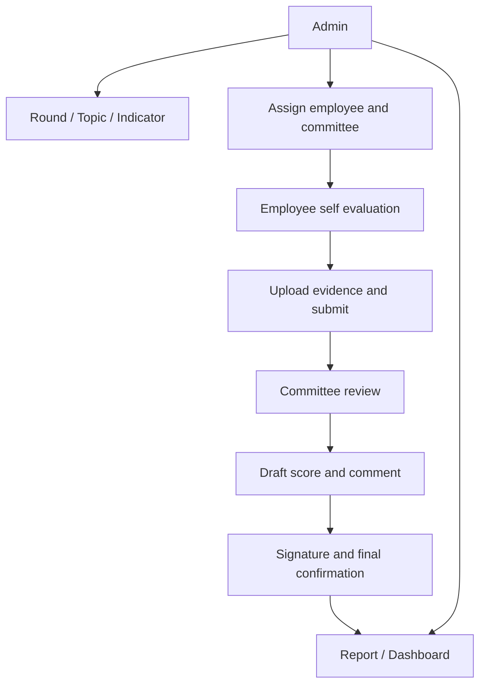

# Flow Diagram

## 1. Login Flow

```mermaid
flowchart TD
 A([Start]) --> B[Enter username and password]
 B --> C{Account exists and active?}
 C -- No --> X[Show login error] --> B
 C -- Yes --> D{Password correct?}
 D -- No --> X
 D -- Yes --> E[Issue signed JWT]
 E --> F{Must change password?}
 F -- Yes --> G[Change password] --> H[Open role dashboard]
 F -- No --> H
 H --> I([End])
```
## 2. Personnel / Admin Flow

```mermaid
flowchart TD
 A([Start]) --> B[Create evaluation round and date range]
 B --> C[Create topics and indicators]
 C --> D[Set evaluation type, weight and evidence]
 D --> E[Create employee and committee accounts]
 E --> F[Assign employee, committee and chair/member]
 F --> G[Monitor progress and committee status]
 G --> H[Review reports / Backup]
 H --> I([End])
```
## 3. Employee Flow

```mermaid
flowchart TD
 A([Login]) --> B[Change first password]
 B --> C[Open assigned evaluation]
 C --> D[Fill self score for each indicator]
 D --> E[Add multiple details and evidence file/URL]
 E --> F[Save draft]
 F --> G{All indicators complete?}
 G -- No --> D
 G -- Yes --> H[Submit self evaluation]
 H --> I[Track committee progress and comments]
 I --> J[Print / Export PDF]
 J --> K([End])
```
## 4. Committee Flow

```mermaid
flowchart TD
 A([Login]) --> B[Open assigned employee]
 B --> C[Review details, self score and evidence]
 C --> D[Score each indicator]
 D --> E[Add comments and summary]
 E --> F[Save draft]
 F --> G[Edit draft if needed]
 G --> H[Attach signature]
 H --> I[Confirm and submit]
 I --> J([End])
```
## 5. System Overview

```mermaid
flowchart TD
 A[Admin] --> B[Round / Topic / Indicator]
 A --> C[Assign employee and committee]
 C --> D[Employee self evaluation]
 D --> E[Upload evidence and submit]
 E --> F[Committee review]
 F --> G[Draft score and comment]
 G --> H[Signature and final confirmation]
 H --> I[Report / Dashboard]
 A --> I
```
